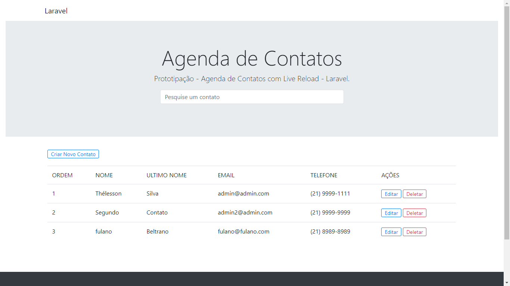
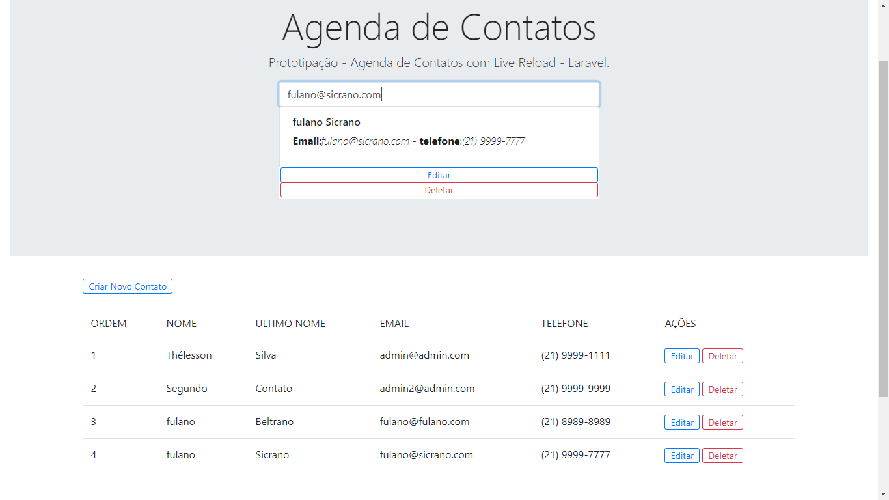
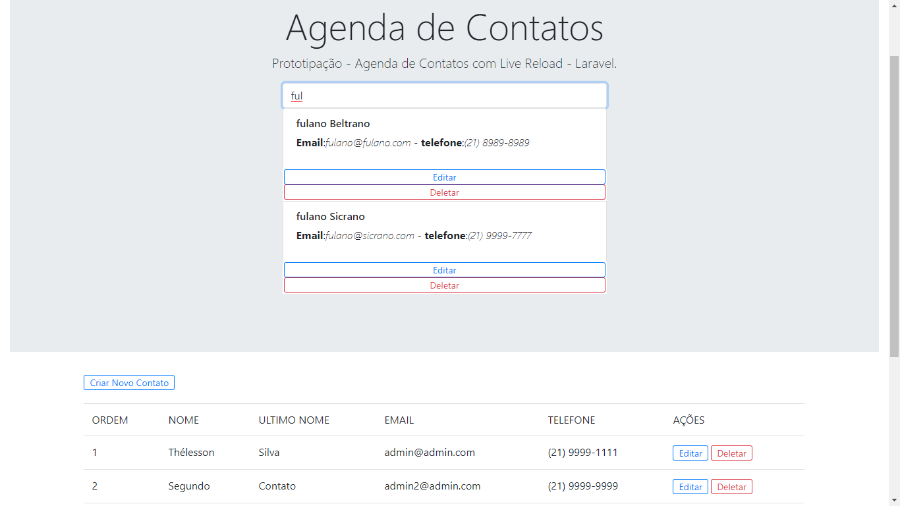
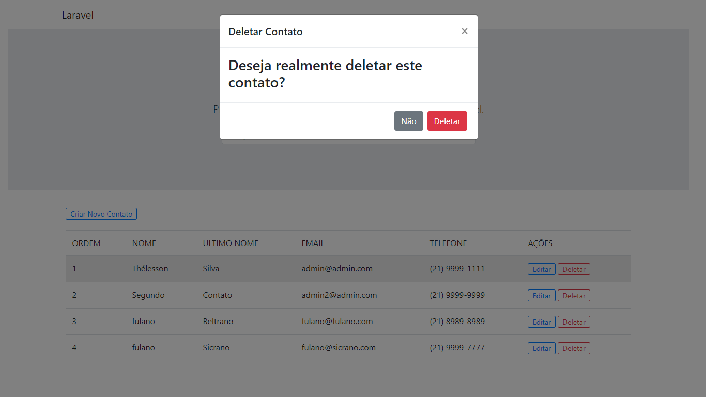
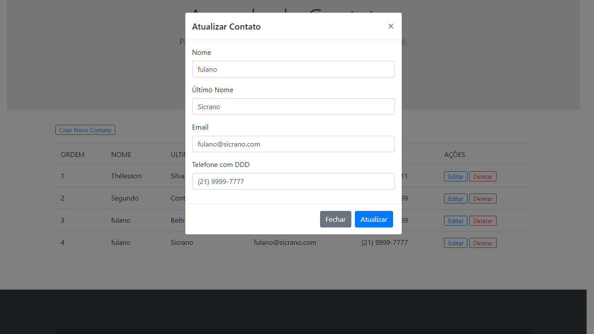
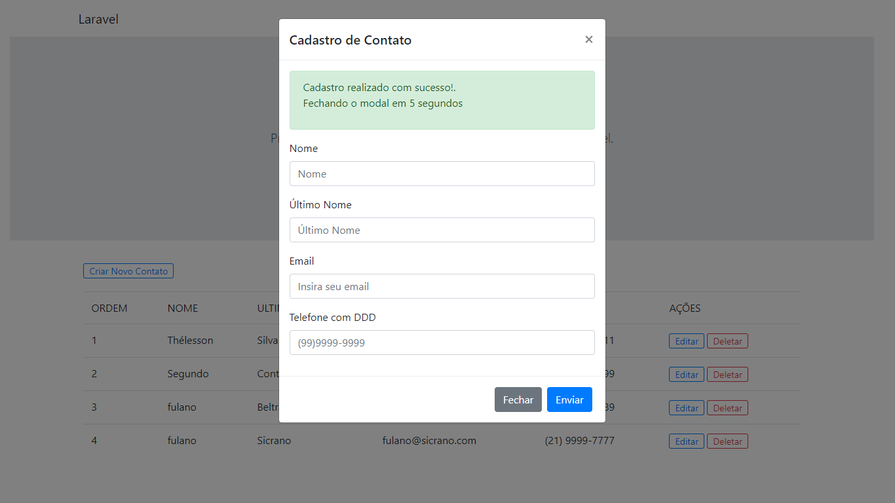
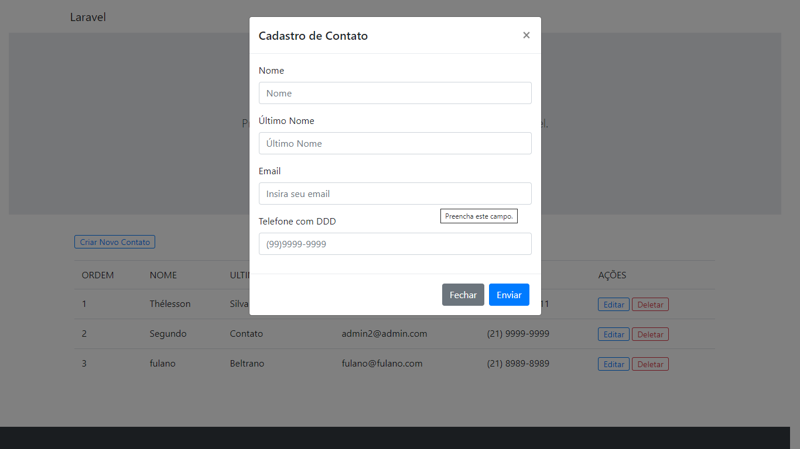

## Laravel - Teste Processo Seletivo - Agenda de Contatos - Single Page Application 

Protótipo de uma aplicação SPA em Laravel que realiza um crud básico para cadastro de contatos.
Pilha Laravel + Liveware + Bootstrap.
Este repositório é o resultado final de uma prova prática entregue aos avaliadores, para concorrer a uma vaga de desenvolvedor Laravel.

  

- [Veja a Demonstração](https://spa.algoritmo9.site).
- login: * Esta aplicação não requer login

## Instalação

 - Clone para o seu servidor
 - Insira suas credenciais no arquivo .env
 - Realize o migrate utilizando o comando: php artisan migrate ou importe o arquivo agenda.sql para a sua base de dados recém criada. 
 - Certifique-se que possui acesso para escrita na pasta /storage
 - Em alguns casos pode ser necessário regenerar o link storage na pasta pública. Delete a pasta /storage localizado em /public e rode o comando: php artisan storage:link

##  Funcionalidades

 - Realizar o cadastro/edição/exclusão/listagem de contatos sem a necessidade de recarregar a página. 
 - Realizar buscas de contatos por nome, ultimo nome, telefone ou email.

## Algumas capturas de tela

  

  

  

  

  

  

  

## 2021

